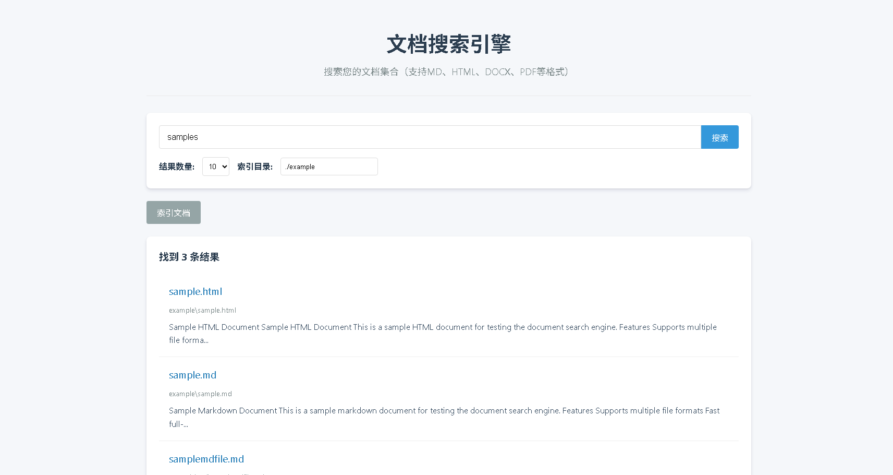
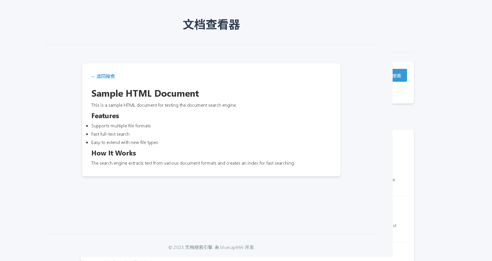

# 文档搜索引擎 📚

> 一个支持多种文档格式的全文搜索引擎

[](https://github.com/bluecap666/DocumentSearchEngine) 
[](https://github.com/bluecap666/DocumentSearchEngine)
[](https://github.com/bluecap666/DocumentSearchEngine)

## ✨ 功能特性

- 🌐 基于Web的用户界面
- 🔍 支持多种文档格式的全文搜索
- 📄 支持HTML和Markdown格式文件
- ⚡ 快速的搜索响应时间
- 📊 搜索结果高亮显示
- 🎯 自动索引功能

## 📋 支持的文件格式

- `.html` / `.htm` - HTML网页文件
- `.md` / `.markdown` - Markdown文档

## 🚀 快速开始

### 环境要求

- Node.js >= 12.x
- npm >= 6.x

### 安装步骤

```bash
# 克隆项目
git clone https://github.com/bluecap666/DocumentSearchEngine.git

# 进入项目目录
cd DocumentSearchEngine

# 安装依赖
npm install
```

### 启动服务

```bash
# 启动服务
npm start
```

服务启动后，访问 `http://localhost:3000`

## 📖 使用说明

1. 系统会在页面加载时自动索引 `./example` 目录下的文档
2. 在搜索框中输入关键词
3. 点击搜索按钮查看结果
4. 点击搜索结果在新窗口中查看文档

## 🖼️ 界面预览

<div align="center">

### 搜索界面


### 搜索结果


*注：请将实际截图文件放入screenshots目录*

</div>

## 🏗️ 技术架构

### 前端技术栈

- HTML5
- CSS3
- JavaScript (ES6+)
- [Lunr.js](https://lunrjs.com/) - 全文搜索引擎

### 后端技术栈

- [Express.js](https://expressjs.com/) - Web框架
- [Cheerio](https://cheerio.js.org/) - HTML解析
- [Marked](https://marked.js.org/) - Markdown解析
- [Glob](https://github.com/isaacs/node-glob) - 文件路径匹配

## 📁 项目结构

```
DocumentSearchEngine/
├── public/                 # 静态资源（HTML, CSS, JS）
│   ├── index.html          # 主页
│   ├── styles.css          # 样式文件
│   └── script.js           # 客户端脚本
├── index.js                # 主服务入口
├── src/
│   ├── SearchEngine.js     # 搜索引擎主类
│   └── services/           # 各种文档格式解析服务
│       ├── HtmlService.js
│       └── MarkdownService.js
├── example/                # 示例文档目录
├── screenshots/            # 界面截图
├── package.json
└── README.md
```

## 🔧 API接口

### 索引文档

```bash
curl -X POST http://localhost:3000/api/index \
  -H "Content-Type: application/json" \
  -d '{"directory": "/path/to/documents"}'
```

### 搜索文档

```bash
curl "http://localhost:3000/api/search?q=search+term&limit=10"
```

## 🤝 贡献

欢迎提交Issue和PR！

## 📄 许可证

MIT License

## 📈 Star趋势

[](https://star-history.com/#bluecap666/DocumentSearchEngine&Date)

---

<div align="center">

Made with ❤️ by [bluecap666](https://github.com/bluecap666)

⭐ 如果这个项目对你有帮助，请给一个Star支持作者！

</div>